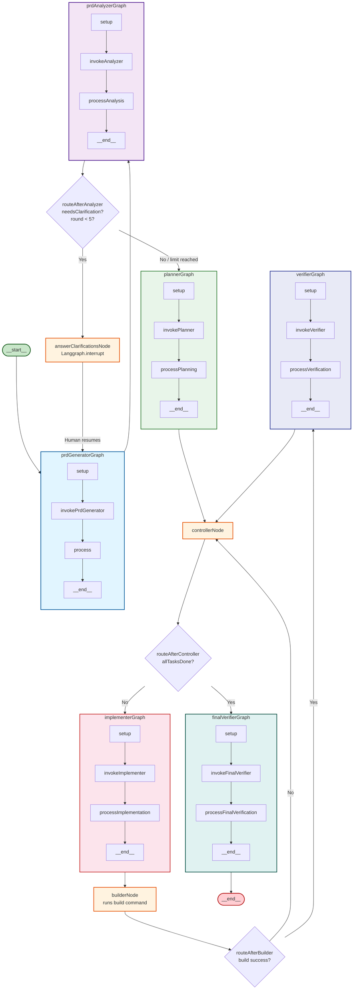

<context>
Every time you add some new feature or logical unit, write it down to this file - .claude/skills/orchestration-tools-context/SKILL.md

# Infinite Interns - Technical Summary

> This document provides technical context for AI agents working on this codebase.

## Project Overview

Infinite Interns is a LangChain-based autonomous software development pipeline. It uses LangGraph to orchestrate specialized AI agents that collaborate to implement features from a task description. The project is in active development — the architecture has been modularized into composable subgraphs.

**Key Architecture Note:** The system uses the `deepagents` npm package from LangChain, which provides built-in filesystem tools, planning capabilities, and subagent support. Agents use custom wrapper backends (`ReadOnlyBackend`, `ReadOnlyShellBackend`) to enforce permission boundaries.

## Technology Stack

- **Framework**: LangChain + LangGraph (TypeScript, ES Modules)
- **LLM Provider**: Google Gemini (`gemini-3-flash-preview` model)
- **Agent Framework**: `deepagents` v1.8.1 (provides filesystem tools, planning, subagents)
- **Orchestration**: LangGraph StateGraph with subgraph composition
- **Structured Output**: Zod schemas via `toolStrategy` (NOT `providerStrategy` — see note below)
- **Development Server**: `@langchain/langgraph-cli` (LangGraph Studio integration)
- **Testing**: Vitest

### Structured Output Strategy

Always use `Langchain.toolStrategy(zodSchema)` for structured output, NOT `providerStrategy`. The `providerStrategy` uses native JSON schema mode which does not work reliably with Gemini when tools are also bound to the agent. The `toolStrategy` adds a synthetic tool call for structured output extraction, which works correctly alongside other tools.

### Key Dependencies

```json
{
  "@langchain/core": "^1.1.29",
  "@langchain/google-genai": "^2.1.22",
  "@langchain/langgraph": "^1.2.0",
  "deepagents": "^1.8.1",
  "zod": "3.25.67"
}
```

## Project Structure

**Monorepo Layout** (as of March 2026):

```
infinite-interns/                    # Monorepo root
├── packages/
│   ├── backend/                     # infinite-interns-backend (LangChain + LangGraph pipeline)
│   │   ├── package.json             # Backend dependencies & scripts
│   │   ├── tsconfig.json
│   │   ├── eslint.config.js
│   │   ├── langgraph.json           # LangGraph Studio config
│   │   ├── src/
│   │   │   ├── agents/
│   │   │   ├── nodes/
│   │   │   ├── backends/
│   │   │   ├── invoke-agent-graph/
│   │   │   ├── main-pipeline-graph/
│   │   │   ├── shared/
│   │   │   └── __tests__/
│   │   ├── eslint-rules/
│   │   ├── ts-plugins/
│   │   └── scripts/
│   └── frontend/                    # infinite-interns-ui (React + Vite UI)
│       ├── package.json             # Frontend dependencies & scripts
│       ├── vite.config.ts
│       ├── tsconfig.json
│       ├── src/
│       │   ├── components/
│       │   ├── hooks/
│       │   └── App.tsx
│       └── index.html
├── package.json                     # Workspace root (npm workspaces)
└── docs/
```

**Backend Source Structure:**

```
packages/backend/src/
├── agents/                           # Specialized agents (each in own directory)
│   ├── prd-generator/                # PRD generation agent
│   │   ├── prd-generator-graph.ts    # Subgraph: setup → invoke → process
│   │   └── prd-generator-types.ts    # State types for PRD generator
│   ├── prd-analyzer/                 # PRD analysis agent
│   │   ├── prd-analyzer-graph.ts     # Subgraph: setup → invoke → process
│   │   └── prd-analyzer-types.ts     # State types for PRD analyzer
│   ├── planner/                      # Implementation planner agent
│   │   ├── planner-graph.ts          # Subgraph: setup → invoke → process
│   │   └── planner-types.ts          # State types for planner (PlannerTask, etc.)
│   ├── implementer/                  # Code implementation agent (FULL write access)
│   │   ├── implementer-graph.ts      # Subgraph: setup → invoke → process
│   │   └── implementer-types.ts      # State types for implementer
│   ├── verifier/                     # Task verification agent
│   │   ├── verifier-graph.ts         # Subgraph: setup → invoke → process
│   │   └── verifier-types.ts         # State types for verifier
│   └── final-verifier/              # Final holistic verification agent
│       ├── final-verifier-graph.ts   # Subgraph: setup → invoke → process
│       └── final-verifier-types.ts   # State types for final verifier
├── nodes/                            # Standalone pipeline nodes (no LLM)
│   ├── answer-clarifications/        # Human clarification interrupt node
│   │   ├── answer-clarifications-node.ts
│   │   └── answer-clarifications-types.ts
│   ├── controller/                   # Task iteration controller
│   │   ├── controller-node.ts        # Orchestrates implementer/builder/verifier loops
│   │   └── controller-types.ts       # State types for controller
│   └── builder/                      # Build command executor
│       ├── builder-node.ts           # Runs build command, checks exit code
│       └── builder-types.ts          # State types for builder
├── backends/                         # Permission-enforcing backend wrappers
│   ├── read-only-backend.ts          # Read-only filesystem (blocks write/edit)
│   └── read-only-shell-backend.ts    # Read + execute (blocks write/edit)
├── invoke-agent-graph/               # Reusable agent invocation subgraph
│   ├── invoke-agent-graph-factory.ts # Factory: creates invoke subgraph with retries
│   ├── invoke-agent-internal-utility.ts # Core: instantiates deepagent + validates output
│   └── invoke-agent-types.ts         # State/IO types for invoke graph
├── main-pipeline-graph/              # Top-level pipeline orchestration
│   ├── main-pipeline-graph.ts        # Main graph: subgraphs + nodes + routing
│   ├── main-pipeline-annotations.ts  # State annotations for pipeline
│   ├── main-pipeline-types.ts        # Type definitions (ClarifyingQuestion, etc.)
│   └── main-pipeline-utility.ts      # (empty, placeholder)
└── shared/                           # Shared utilities
    ├── gemini-flash-model.ts         # Singleton Gemini Flash LLM instance
    ├── shared-types.ts               # Common type aliases (AnnotationRoot)
    └── util.ts             # Helpers: lastValue, isNotNull, sleep, etc.

eslint-rules/                         # Custom ESLint rules
├── enforce-explicit-types.cjs        # Strict typing enforcement
├── enforce-namespace-imports.cjs     # import * as Name style
├── enforce-brackets.cjs              # Control structure brackets
├── enforce-node-state-access.cjs     # Pipeline node state ownership enforcement
└── no-unused-exports.cjs             # Unused export detection (currently off)

ts-plugins/                           # TypeScript compiler plugins
└── namespace-import-plugin/          # Enforces namespace imports at TS level

langgraph.json                        # LangGraph CLI config
```

## Architecture Patterns

### 1. Composable Subgraph Pattern

The pipeline is built from composable LangGraph subgraphs. Each agent is a self-contained subgraph that can be independently tested and composed into the main pipeline.

```
Main Pipeline Graph
  ├── PRD Generator Subgraph          (Invoke Agent Subgraph)
  ├── PRD Analyzer Subgraph           (Invoke Agent Subgraph)
  ├── answerClarificationsNode        (interrupt for human input)
  ├── Planner Subgraph                (Invoke Agent Subgraph)
  ├── controllerNode                  (plain node — task iteration)
  │     ├── Implementer Subgraph      (Invoke Agent Subgraph, FULL write access)
  │     ├── builderNode               (plain node — runs build command)
  │     └── Verifier Subgraph         (Invoke Agent Subgraph)
  └── Final Verifier Subgraph         (Invoke Agent Subgraph)
```

### 2. Invoke Agent Graph (Reusable)

The `invoke-agent-graph` module is a generic, reusable subgraph for invoking any deepagent with retry logic. Created via factory function:

```typescript
createInvokeAgentGraph(
  backendClass, // Backend type (ReadOnly, ReadOnlyShell, LocalShell)
  model, // LLM model instance (or null — resolved at runtime from state)
  systemPrompt, // Agent system prompt
  responseZod, // Zod schema for structured output validation
  maxInSessionAttempts, // Retries within same session (default 3, overridable via state)
  maxSessionAttempts // Fresh session retries (default 3, overridable via state)
);
```

**Flow:** firstInvoke → [success? → end] / [fail? → repeat → ...]

Retry logic includes exponential backoff (5s sleep between retries).

### 3. Agent/Node Directory Pattern

Each agent or standalone node lives in its own directory under `src/agents/` with:

- `*-graph.ts` — For subgraphs (setup → invoke → process nodes)
- `*-node.ts` — For standalone pipeline nodes (not subgraphs)
- `*-types.ts` — State and IO type definitions (if needed)

### 4. Node Naming Convention

**CRITICAL: `.addNode()` calls must follow these rules:**

1. The first parameter (string name) must end with either `Node` or `Graph` to clearly indicate what it is
2. The first parameter (string name) and second parameter (variable reference) must match in name

```typescript
// ✅ GOOD - name matches variable, ends with Graph/Node
.addNode("prdGeneratorGraph", PrdGeneratorGraph.prdGeneratorGraph)
.addNode("answerClarificationsNode", AnswerClarificationsNode.answerClarificationsNode)

// ❌ BAD - name doesn't end with Graph/Node
.addNode("answerClarifications", answerClarificationsNode)

// ❌ BAD - name doesn't match variable
.addNode("analyzer", PrdAnalyzerGraph.prdAnalyzerGraph)
```

### 5. Backend Permission Model

Agents have different filesystem access levels enforced at the backend level:

| Backend                | Capabilities                           | Use Case              |
| ---------------------- | -------------------------------------- | --------------------- |
| `ReadOnlyBackend`      | read_file, glob, grep, ls (NO write)   | Analysis-only agents  |
| `ReadOnlyShellBackend` | read + execute (NO write)              | Verification agents   |
| `LocalShellBackend`    | **FULL ACCESS** (read, write, execute) | Implementation agents |

When a read-only agent attempts to write, it receives an error response rather than silently succeeding.

## State Design Rules

### `[Something]State` Structure

Each `[Something]State` type can ONLY contain these sub-fields:

- `output` — Data produced by this node/subgraph for downstream consumers
- `internal` — Private bookkeeping (counters, flags) not meant for other nodes

**No other fields are allowed directly on the state type.** For example, `clarificationRound` must go inside `internal`, not directly on the state.

```typescript
// ✅ GOOD
type AnswerClarificationsState = {
  output: AnswerClarificationsOutput | null | undefined;
  internal: NonNullable<AnswerClarificationsInternal>;
};

// ❌ BAD - field directly on state instead of in internal
type AnswerClarificationsState = {
  clarificationRound: NonNullable<number>; // WRONG - must be in internal
};
```

### Always Use `output` for Data Handoff

**All data handoff between nodes uses `output` fields.** A node always writes to its own `output`, and downstream nodes read from the upstream `output` directly.

```typescript
// ✅ CORRECT - write to own output, downstream reads it directly
function answerClarificationsNode(state: MainPipelineState) {
  const questions = state.prdAnalyzerState.output.questions;
  const previousClarifications = state.prdAnalyzerState.output.clarifications;
  state.answerClarificationsState.output = { clarifications: allClarifications };
}

// ❌ WRONG - writing to another node's input
function answerClarificationsNode(state: MainPipelineState) {
  state.prdGeneratorState.input.clarifications = allClarifications; // NEVER do this
}
```

## State Access Rules for Subgraphs and Nodes

**CRITICAL: These rules govern how nodes/subgraphs in the main pipeline access state.**

Each node or subgraph in the main pipeline can only:

- **Read outputs** of its **direct upstream neighbors** — nodes/subgraphs with a direct edge leading to it. Reading from non-neighbors is forbidden, even if the data exists in state.
- **Access its own state**: `internal` is read/write, `output` is read/write.

In practice this means:

- A subgraph's **process** node writes its own `output` (which the next direct neighbor reads).
- A subgraph reads upstream `output` fields only from its **direct predecessor** in the graph.
- The main pipeline never has "bridge" nodes — data handoff happens via outputs.
- **Pass-through pattern**: If a downstream node needs data that originated further upstream, each intermediate node must include that data in its own `output`. For example, the analyzer passes the PRD through in `prdAnalyzerState.output.prd` so the planner (its direct downstream neighbor) can read it without reaching back to `prdGeneratorState`.

These rules are not enforced by the codebase but are critical for maintaining clear data flow and avoiding bugs so it is up to you to strictly follow them. Always follow them when creating new subgraphs or nodes.

### What this means in code

```typescript
// In answerClarifications node:
// ✅ Read upstream outputs
const questions = state.prdAnalyzerState.output.questions;
const clarifications = state.prdAnalyzerState.output.clarifications;

// ✅ Write own output and internal
state.answerClarificationsState.output = { clarifications: allClarifications };
state.answerClarificationsState.internal.clarificationRound++;

// ❌ WRONG: writing to another node's state
state.prdGeneratorState.input = { clarifications: allClarifications }; // NEVER do this

// ❌ WRONG: creating bridge nodes in main pipeline for data transfer
```

### The one shared exception: `invokeAgentState`

`invokeAgentState` is a shared scratchpad used by all invoke-agent subgraphs. Each agent's setup node writes to `invokeAgentState.input`, the invoke subgraph writes to `invokeAgentState.output`, and the process node reads from `invokeAgentState.output`. This is overwritten on every invocation — it does not accumulate.

## Main Pipeline Flow



- **Max clarification rounds**: 5 (hardcoded)
- **`answerClarificationsNode`** uses `Langgraph.interrupt()` to pause and present questions to human
- Human resumes with `Command({ resume: ["answer1", "answer2", ...] })`
- The interrupt node is a **direct node in the main pipeline**, not inside any subgraph
- **Implementation cycle**: controller → implementer → builder → verifier → controller (loops per task)
- **Implementation retry limit**: 7 per task by default (configurable via `maxImplementationAttempts`). Both build failures and verification failures increment the same `failedAttempts` counter. Counter resets on task success
- **Final verifier** runs once after all tasks complete — does NOT loop

## Currently Implemented Agents

### PRD Generator Agent

- **Purpose**: Generates a Product Requirements Document from a task description
- **Backend**: `ReadOnlyBackend` (read-only filesystem access)
- **Subgraph flow**: setup → invokePrdGenerator → process → `__end__`
- **Zod Schema**: Validates `precision` (0-100) and `prd` (string)
- **process node**: Writes `prdGeneratorState.output` with the PRD and clarifications (pass-through from `answerClarificationsState.output`)

### PRD Analyzer Agent

- **Purpose**: Analyzes a PRD to determine if clarifications are needed
- **Backend**: `ReadOnlyBackend` (read-only filesystem access)
- **Subgraph flow**: setup → invokeAnalyzer → processAnalysis → `__end__`
- **Zod Schema**: Validates `needsClarification` (boolean), `questions` (string[]), `confidence` (1-10), `reasoning` (string)
- **Output**: Writes `prdAnalyzerState.output` with analysis result plus pass-through of `prd` and `clarifications`
- **Pass-through**: The `processAnalysis` node copies `prdGeneratorState.output.prd` and `prdGeneratorState.output.clarifications` into its own output so downstream neighbors don't need to reach back to the generator
- **Does NOT handle human interaction** — that's the main pipeline's job

### answerClarificationsNode (Main Pipeline Node)

- **Purpose**: Presents analyzer questions to human and collects answers
- **Location**: `src/nodes/answer-clarifications/answer-clarifications-node.ts`
- **Mechanism**: `Langgraph.interrupt(questions)` pauses execution; human resumes with `Command({ resume: answers })`
- **Reads**: `prdAnalyzerState.output` (questions and previous clarifications, passed through by analyzer)
- **Writes**: own `output.clarifications` (accumulated clarifications), own `internal.clarificationRound`
- **Uses one question type** throughout the cycle: `ClarifyingQuestion = { question, answer }`. The analyzer outputs plain `string[]` questions, and `answerClarificationsNode` pairs them with human answers into `ClarifyingQuestion[]`.

### Planner Agent

- **Purpose**: Divides the finalized PRD into sequential implementation tasks and determines the build command
- **Backend**: `ReadOnlyShellBackend` (read + execute, no write)
- **Subgraph flow**: setup → invokePlanner → processPlanning → `__end__`
- **Zod Schema**: Validates `tasks` — array of `{ title, description, relevantFiles }`, plus `buildCommand` (string)
- **Reads**: `prdAnalyzerState.output.prd`, `prdAnalyzerState.output.clarifications`, `state.assignment`, `state.buildCommand`
- **Output**: Writes `plannerState.output` with ordered tasks list and the build command
- **Build command**: If the user provides `buildCommand` in the pipeline input, the planner uses it. Otherwise, the planner determines the appropriate command by analyzing the codebase
- **Runs after**: The clarification cycle ends (when analyzer says no more clarifications needed, or round limit reached)

### controllerNode (Main Pipeline Node — No LLM)

- **Purpose**: Iterates through the planner's task list sequentially, orchestrating the implementer → builder → verifier cycle for each task
- **Location**: `src/nodes/controller/controller-node.ts`
- **No LLM**: Pure deterministic logic — no agent invocation
- **Reads**: `plannerState.output` (tasks, buildCommand), `builderState.output` (build result), `verifierState.output` (verification result), `prdAnalyzerState.output.prd`
- **Writes**: `controllerState.output` (current task info for implementer), `controllerState.internal` (task index, attempt counters), clears `builderState.output` and `verifierState.output` after processing
- **Routing**: Routes to `implementerGraph` (has remaining tasks) or `finalVerifierGraph` (all tasks done)
- **Retry tracking**: Uses a unified `failedAttempts` counter per task. Both build failures and verification failures increment the same counter. Counter resets to 0 when a task succeeds (verifier passes). Throws when `failedAttempts >= state.maxImplementationAttempts` (default 7)

### Implementer Agent

- **Purpose**: Implements code changes for a single task. The ONLY agent with full write access
- **Backend**: `LocalShellBackend` (FULL ACCESS — read, write, execute)
- **Subgraph flow**: setup → invokeImplementer → processImplementation → `__end__`
- **Zod Schema**: Validates `summary` (string)
- **Setup**: Reads `controllerState.output` to determine whether this is an initial implementation or a correction run. Constructs different user messages for each case
- **Initial run**: Receives task description, build command, full PRD, and a summary of all tasks in the plan
- **Correction run**: Receives original task description, the error (build failure or verification failure), and instruction to fix. Fresh session with no prior context
- **Prompt guidance**: System prompt encourages the implementer to run the build command itself

### builderNode (Main Pipeline Node — No LLM)

- **Purpose**: Runs the build command and checks the exit code
- **Location**: `src/nodes/builder/builder-node.ts`
- **No LLM**: Pure shell execution — runs `plannerState.output.buildCommand` in `state.projectDir`
- **Writes**: `builderState.output` with `{ success, errorOutput }`
- **Error truncation**: Build error output is truncated to 4000 characters (keeping the tail) before storing
- **Timeout**: 5-minute timeout for build commands
- **Routing**: On success → `verifierGraph`. On failure → `controllerNode` (for correction)

### Verifier Agent

- **Purpose**: Verifies that the implementation satisfies the current task requirements
- **Backend**: `ReadOnlyShellBackend` (read + execute, no write)
- **Subgraph flow**: setup → invokeVerifier → processVerification → `__end__`
- **Zod Schema**: Validates `success` (boolean) and `failureDescription` (string | null)
- **Reads**: `controllerState.output` (current task info, PRD)
- **Always routes to**: `controllerNode` — the controller decides whether to advance, correct, or throw
- **On success**: Controller advances to the next task
- **On failure**: Controller sets up a correction implementer (fresh session) which goes through the full builder → verifier cycle again

### Final Verifier Agent

- **Purpose**: Holistically verifies the entire implementation after ALL tasks are completed
- **Backend**: `ReadOnlyShellBackend` (read + execute, no write)
- **Subgraph flow**: setup → invokeFinalVerifier → processFinalVerification → `__end__`
- **Zod Schema**: Validates `success` (boolean), `problems` (string[]), `suggestedFollowUpPrompt` (string | null)
- **Reads**: `prdAnalyzerState.output.prd`, `state.assignment`, `prdGeneratorState.output.clarifications`
- **On success**: Pipeline ends with success
- **On failure**: Pipeline ends with a list of problems and a suggested follow-up prompt. Does NOT execute fixes — user must initiate a new run

## Core Data Models

### ClarifyingQuestion (single type used throughout the cycle)

```typescript
type ClarifyingQuestion = {
  question: string;
  answer: string | null | undefined;
};

type ClarifyingQuestions = Array<ClarifyingQuestion>;
```

### InvokeAgentState (shared scratchpad)

```typescript
type InvokeAgentState = {
  input: InvokeAgentInput; // { conversationHistory, userMessage, modelConfig, retryConfig }
  output: InvokeAgentOutput; // { result: ZodObject output }
  internal: InvokeAgentInternal; // { succeeded, errorMessage, attempt counters }
};
```

### PrdGeneratorState

```typescript
type PrdGeneratorState = {
  output: PrdGeneratorOutput; // { prd, clarifications (pass-through from answerClarificationsState.output) }
};
```

### PrdAnalyzerState

```typescript
type PrdAnalyzerAgentResult = {
  needsClarification: boolean;
  questions: Array<string>;
  confidence: number;
  reasoning: string;
};

type PrdAnalyzerOutput = PrdAnalyzerAgentResult & {
  prd: string; // pass-through from prdGeneratorState.output.prd
  clarifications: ClarifyingQuestions | null | undefined; // pass-through
};

type PrdAnalyzerState = {
  output: PrdAnalyzerOutput | null;
};
```

### AnswerClarificationsState

```typescript
type AnswerClarificationsOutput = {
  clarifications: ClarifyingQuestions; // accumulated across all rounds
};

type AnswerClarificationsState = {
  output: AnswerClarificationsOutput | null | undefined;
  internal: AnswerClarificationsInternal; // { clarificationRound }
};
```

### PlannerState

```typescript
type PlannerTask = {
  title: string;
  description: string;
  relevantFiles: Array<string>;
};

type PlannerOutput = {
  tasks: Array<PlannerTask>;
  buildCommand: string;
};

type PlannerState = {
  output: PlannerOutput | null;
};
```

### ControllerState

```typescript
type ControllerOutput = {
  currentTaskIndex: number;
  currentTask: PlannerTask;
  buildCommand: string;
  prd: string;
  allTasksSummary: string;
  isCorrection: boolean;
  correctionError: string | null | undefined;
};

type ControllerInternal = {
  currentTaskIndex: number;
  /** Unified counter — both build and verification failures increment this. Resets on task success. */
  failedAttempts: number;
  allTasksDone: boolean;
};

type ControllerState = {
  output: ControllerOutput | null;
  internal: ControllerInternal;
};
```

### ImplementerState

```typescript
type ImplementerOutput = {
  summary: string;
};

type ImplementerState = {
  output: ImplementerOutput | null;
};
```

### BuilderState

```typescript
type BuilderOutput = {
  success: boolean;
  errorOutput: string | null | undefined;
};

type BuilderState = {
  output: BuilderOutput | null;
};
```

### VerifierState

```typescript
type VerifierOutput = {
  success: boolean;
  failureDescription: string | null | undefined;
};

type VerifierState = {
  output: VerifierOutput | null;
};
```

### FinalVerifierState

```typescript
type FinalVerifierOutput = {
  success: boolean;
  problems: Array<string>;
  suggestedFollowUpPrompt: string | null | undefined;
};

type FinalVerifierState = {
  output: FinalVerifierOutput | null;
};
```

## Shared Utilities

- **`lastValue<T>()`**: "Last write wins" reducer for LangGraph state annotations
- **`isNotNullOrUndf()`**: Type guard for non-null/undefined values
- **`isNotNullOrEmpty()`**: Type guard for non-empty arrays/strings
- **`applyDefault<T>()`**: Apply default value if target is null/undefined
- **`sleep()`**: Promise-based sleep using Node timers
- **`geminiFlashLLMMedium`**: Singleton Gemini Flash model (temp 0.5)
- **`AnnotationRoot`**: Type alias for LangGraph `Annotation.Root` return type

## Creating a New Subgraph Agent

Follow this guide to create a new agent subgraph without looking at example code.

### Step 1: Define State Types

Create `src/agents/[agent-name]/[agent-name]-types.ts`:

```typescript
export type MyAgentOutput = {
  result: NonNullable<string>;
  confidence: NonNullable<number>;
};

export type MyAgentState = {
  output: MyAgentOutput | null | undefined;
  // If internal bookkeeping is needed:
  // internal: NonNullable<MyAgentInternal>;
};
```

**Rules:**

- No `input` field — read upstream outputs directly (state access rules)
- `output` is nullable (initially null before agent runs)
- Internal bookkeeping (counters, flags) goes in `internal`, never directly on the state
- Only `output` and `internal` are allowed as fields on a `[Something]State` (exception: `InvokeAgentState` also has `input` since it is a reusable scratchpad)

### Step 2: Create Zod Schema for LLM Output

In the same file or in the graph file:

```typescript
export const myAgentOutputSchema = Zod.z.object({
  result: Zod.z.string().describe("The agent result"),
  confidence: Zod.z.number().min(0).max(10).describe("Confidence 0-10"),
});
```

### Step 3: Create the Subgraph

Create `src/agents/[agent-name]/[agent-name]-graph.ts`:

```typescript
import * as Langgraph from "@langchain/langgraph";
import { type MainPipelineState } from "../../main-pipeline-graph/main-pipeline-types";
import * as MainPipelineAnnotations from "../../main-pipeline-graph/main-pipeline-annotations";
import * as InvokeAgentGraphFactory from "../../invoke-agent-graph/invoke-agent-graph-factory";
import * as ReadOnlyBackend from "../../backends/read-only-backend";
import * as GeminiFlashModel from "../../shared/gemini-flash-model";
import { type InvokeAgentOutput } from "../../invoke-agent-graph/invoke-agent-types";
import { myAgentOutputSchema, type MyAgentOutput } from "./my-agent-types";

const systemPrompt: NonNullable<string> = `Your role is to...`;

const invokeGraph = InvokeAgentGraphFactory.createInvokeAgentGraph(
  ReadOnlyBackend.ReadOnlyBackend,
  GeminiFlashModel.geminiFlashLLMMedium,
  systemPrompt,
  myAgentOutputSchema,
  3, // maxInSessionAttempts
  3 // maxSessionAttempts
);

// Node 1: setup - reads upstream outputs, constructs user message
function setup(state: NonNullable<MainPipelineState>): NonNullable<Partial<MainPipelineState>> {
  // Read ONLY upstream outputs (not inputs, not internal state)
  const upstreamData: NonNullable<string> = state.prdGeneratorState.output.prd;

  const message: NonNullable<string> = `Analyze the data: ${upstreamData}`;

  // Write to invokeAgentState (shared scratchpad)
  state.invokeAgentState.input = {
    conversationHistory: null,
    userMessage: message,
  };

  const update: NonNullable<Partial<MainPipelineState>> = { invokeAgentState: state.invokeAgentState };
  return update;
}

// Node 2: process - reads agent output, writes own output
function process(state: NonNullable<MainPipelineState>): NonNullable<Partial<MainPipelineState>> {
  const invokeAgentOutput: NonNullable<InvokeAgentOutput> =
    state.invokeAgentState.output ??
    (() => {
      throw new Error("Invoke agent output is null or undefined");
    })();

  const parsed: NonNullable<MyAgentOutput> = myAgentOutputSchema.parse(invokeAgentOutput.result);

  // Write own output (downstream nodes read this directly)
  state.myAgentState.output = parsed;

  const update: NonNullable<Partial<MainPipelineState>> = {
    myAgentState: state.myAgentState,
  };
  return update;
}

// Compile the subgraph
export const myAgentGraph = new Langgraph.StateGraph({
  stateSchema: MainPipelineAnnotations.mainPipelineStateAnnotation,
})
  .addNode("setup", setup)
  .addNode("invokeGraph", invokeGraph)
  .addNode("process", process)
  .addEdge("__start__", "setup")
  .addEdge("setup", "invokeGraph")
  .addEdge("invokeGraph", "process")
  .addEdge("process", "__end__")
  .compile();
```

### Step 4: Register in Main Pipeline Annotations

Update `src/main-pipeline-graph/main-pipeline-annotations.ts`:

```typescript
import { type MyAgentState } from "../agents/my-agent/my-agent-types";

export const mainPipelineStateAnnotation = Langgraph.Annotation.Root({
  ...mainPipelineInputAnnotation.spec,
  invokeAgentState: Langgraph.Annotation<InvokeAgentState>(),
  myAgentState: Langgraph.Annotation<MyAgentState>(),
  // ... other states
});
```

### Step 5: Add to Main Pipeline Graph

Update `src/main-pipeline-graph/main-pipeline-graph.ts`:

```typescript
import * as MyAgentGraph from "../agents/my-agent/my-agent-graph";

const graphBuilder = new Langgraph.StateGraph({...})
  .addNode("myAgentGraph", MyAgentGraph.myAgentGraph)
  .addEdge("prdAnalyzerGraph", "myAgentGraph")
  .addEdge("myAgentGraph", "__end__")
  // or add conditional routing if needed
  .addConditionalEdges("myAgentGraph", routeFunction, ["nextNode", "__end__"]);
```

### Step 6: Register in langgraph.json

Add to `langgraph.json`:

```json
{
  "graphs": {
    "myAgent": "./src/agents/my-agent/my-agent-graph.ts:myAgentGraph"
  }
}
```

### Data Flow Pattern

```
Upstream.output → [setup node] → invokeAgentState.input
                                       ↓
                              [invokeGraph subgraph]
                                       ↓
                                invokeAgentState.output
                                       ↓
                               [process node] → myAgentState.output
                                                  (downstream reads this directly)
```

**Key Rules:**

- **setup**: Read upstream outputs, write `invokeAgentState.input`
- **invokeGraph**: LLM call (auto-provided, don't write this)
- **process**: Parse `invokeAgentState.output`, write own output
- Downstream nodes read your `output` directly — no need to write their `input`
- Never write to upstream state
- Never read upstream input or internal state

## Running the Project

### Monorepo Workspace Commands (from root)

```bash
# Run backend only (LangGraph Studio at localhost:8123)
npm run dev

# Run frontend only (Vite at localhost:5173)
npm run dev:frontend

# Run both backend and frontend in parallel
npm run dev:both

# Run linting, type checking, tests, etc. for backend
npm run fix        # Lint + format + type check
npm run test       # Run tests once
npm run test:watch # Run tests in watch mode
npm run lint       # Lint check only
npm run ts         # Type check only
```

### Backend-Specific Commands

```bash
cd packages/backend

# Development
npm run dev        # Start LangGraph Studio
npm run dev:debug  # Start with debugger on 0.0.0.0:9229

# Quality checks
npm run fix        # Lint + format + type check (mandatory before commits)
npm run test       # Run all tests
npm run test:watch # Watch mode
npm run test:debug # Debug mode with --inspect-brk
npm run lint       # Lint only
npm run ts         # Type check only
npm run format     # Format only
```

### Frontend-Specific Commands

```bash
cd packages/frontend

# Development & build
npm run dev     # Start Vite at localhost:5173 (with /api proxy to backend)
npm run build   # Build for production
npm run preview # Preview production build
```

### Debug Entry Point

`packages/backend/src/debug-entry.ts` provides a standalone entry point for VSCode debugging. Launch config "Debug Pipeline" in `.vscode/launch.json` runs it with `tsx`.

### Environment Variables

Backend environment (set in `packages/backend/.env`):

```env
GOOGLE_API_KEY=your-google-api-key
LANGSMITH_API_KEY=your-langsmith-key  # Optional, for tracing
LANGGRAPH_SCHEMA_RESOLVE_TIMEOUT_MS=120000
```

## Lint and TypeScript

Always run `npm run fix` in the root (which runs it for backend) when you make changes in `.ts` files. This runs formatting (Prettier), lint check (ESLint with auto-fix), and TypeScript type checking. It returns even TypeScript errors, not only lints. This command is all you need to check your code.

## Code Style Requirements

This project uses custom ESLint rules that enforce strict typing patterns different from typical TypeScript defaults.

### 1. Explicit Type Annotations Required

All variables, parameters, return types, and class properties must have explicit type annotations. This is automatically fixed by running fix.

```typescript
// ❌ BAD - no type annotation
const count = 5;
const name = "hello";
function process(data) { ... }
function getData() { return items; }

// ✅ GOOD - explicit types
const count: number = 5;
const name: string = "hello";
function process(data: InputData): void { ... }
function getData(): Array<Item> { return items; }
```

**Exceptions:**

- Destructuring patterns are allowed without type annotations - when the type definition would be longer than 100 characters.
- Arrow function shorthand (single expression, no block) is allowed without return type

### 2. No Inline Complex Types

Complex types must be extracted to named `type` aliases. Do NOT use inline:

- Union types (except simple `T | null` or `T | undefined`)
- Intersection types
- Object literal types
- Tuple types
- Function types
- Conditional types
- Mapped types

```typescript
// ❌ BAD - inline complex types
const handler: (x: number) => void = ...;
const data: { name: string; age: number } = ...;
const result: "success" | "error" | "pending" = ...;
const pair: [string, number] = ...;

// ✅ GOOD - extract to named types. Name the types in descriptive way - not patterns like [function name]Input, [function name]Output, and so on.
type Handler = (x: number) => void;
type Data = { name: string; age: number };
type Result = "success" | "error" | "pending";
type Pair = [string, number];

const handler: Handler = ...;
const data: Data = ...;
const result: Result = ...;
const pair: Pair = ...;
```

### 3. No Inline Return Values

Do NOT return computed values directly. Assign to a variable first, then return the variable. All return paths must return the same type:

```typescript
// ❌ BAD - inline returns
function getName(): string {
  return "hello";
}
function calculate(): number {
  return a + b;
}
function buildObject(): Config {
  return { key: value };
}

// ✅ GOOD - assign then return
function getName(): string {
  const name: string = "hello";
  return name;
}
function calculate(): number {
  const result: number = a + b;
  return result;
}
function buildObject(): Config {
  const config: Config = { key: value };
  return config;
}
```

**Allowed inline returns:**

- Variables/identifiers: `return myVar;`
- Member expressions: `return obj.property;`
- `undefined`: `return undefined;` or `return;`
- Empty string: `return "";`

**NOT allowed inline:**

- Literals (strings, numbers, booleans): `return "hello";` ❌
- `null`: `return null;` ❌
- Object/array literals: `return { ... };` ❌
- Function calls: `return doSomething();` ❌
- Computed expressions: `return a + b;` ❌

### 4. No Duplicate Variable Declarations

Do NOT declare variables with the same name multiple times in a function:

```typescript
// ❌ BAD - same variable name declared twice
function process(): void {
  const result: string = step1();
  // ... more code ...
  const result: string = step2(); // Error!
}

// ✅ GOOD - unique names or reassign
function process(): void {
  const result1: string = step1();
  const result2: string = step2();
}
// OR
function process(): void {
  let result: string = step1();
  result = step2();
}
```

### 5. Namespace Imports

All imports must use namespace import style:

```typescript
// ❌ BAD
import { StateGraph } from "@langchain/langgraph";
import { ChatGoogleGenerativeAI } from "@langchain/google-genai";

// ✅ GOOD
import * as LangGraph from "@langchain/langgraph";
import * as LangChainGoogleGenai from "@langchain/google-genai";
```

Type-only imports use inline `type` keyword:

```typescript
import { type SomeType } from "./types.js";
```

### 6. Bracket Enforcement

All control structures (if, else, for, while, etc.) must use brackets, even for single-line bodies.

## Global Pipeline Input Fields

The main pipeline input annotation includes the following required and optional fields:

```typescript
export const mainPipelineInputAnnotation = Langgraph.Annotation.Root({
  assignment: Langgraph.Annotation<string>(),
  projectDir: Langgraph.Annotation<string>(),
  buildCommand: Langgraph.Annotation<string | null | undefined>(),
  finalVerifierEnabled: Langgraph.Annotation<boolean>(),
  clarificationRounds: Langgraph.Annotation<number>(),       // default 5
  maxImplementationAttempts: Langgraph.Annotation<number>(),  // default 7
  agentConfigs: Langgraph.Annotation<AgentConfigs | null | undefined>(), // default null
});
```

### buildCommand

If `buildCommand` is provided by the user, the planner uses it directly. If null/undefined, the planner determines the appropriate build command by analyzing the codebase.

### finalVerifierEnabled

Controls whether the final verifier agent runs after all tasks complete. If `false`, the pipeline skips the final verifier and goes directly to `__end__`. If `true`, the final verifier agent runs holistically to verify the entire implementation. User must set this before launching the pipeline (required boolean field).

### clarificationRounds

Maximum number of clarification rounds before the pipeline proceeds to planning. Default: 5. Read by `routeAfterAnalyzer` in routing.

### maxImplementationAttempts

Maximum number of failed attempts (build failures + verification failures combined) per task before the pipeline throws. Default: 7. Read by `controllerNode`.

### agentConfigs

Per-agent model and retry configuration. Type: `Record<LlmAgentNode, AgentConfig>` where each `AgentConfig` contains `modelConfig` (model, temperature, thinkingEnabled) and `retryConfig` (maxInSessionAttempts, maxSessionAttempts). If null, agents use the default `geminiFlashLLMMedium` singleton and constructor retry limits.

## Unit Testing

### MANDATORY: Tests Required for All Changes

**Every code change MUST include corresponding unit tests.** This applies to:

- **New features**: Add tests covering the new node/subgraph/routing function
- **Bug fixes**: Add a test that reproduces the bug (fails without the fix, passes with it)
- **Refactoring**: Ensure existing tests still pass; add new tests if behavior boundaries change

Do NOT skip tests even when the user only asks to "fix" something or "add" a feature. Tests are part of the definition of done.

### Test Structure

```
src/__tests__/
  helpers/
    mock-state-factory.ts          # Creates full MainPipelineState with overrides
  infrastructure/
    util.test.ts         # Tests for shared utility functions
  routing/
    main-pipeline-routing.test.ts  # Tests for routing functions
  nodes/
    controller-node.test.ts        # Tests for controller node
    builder-node.test.ts           # Tests for builder node
    answer-clarifications-node.test.ts  # Tests for clarification node
  agents/
    prd-generator-graph.test.ts    # Tests for PRD generator subgraph
    prd-analyzer-graph.test.ts     # Tests for PRD analyzer subgraph
    planner-graph.test.ts          # Tests for planner subgraph
    implementer-graph.test.ts      # Tests for implementer subgraph
    verifier-graph.test.ts         # Tests for verifier subgraph
    final-verifier-graph.test.ts   # Tests for final verifier subgraph
```

### Mock State Factory

Use `MockStateFactory.createMockState(overrides?)` to create full `MainPipelineState` objects. It provides sensible defaults and accepts deep partial overrides:

```typescript
import * as MockStateFactory from "../helpers/mock-state-factory";

const state = MockStateFactory.createMockState({
  controllerState: {
    output: {
      currentTaskIndex: 0,
      currentTask: { title: "Add user model", description: "Create user model", relevantFiles: ["src/models/user.ts"] },
      buildCommand: "npm run build",
      prd: "Full PRD document",
      allTasksSummary: "1. Add user model",
      isCorrection: false,
      correctionError: null,
    },
    internal: { currentTaskIndex: 0, failedAttempts: 0, allTasksDone: false },
  },
});
```

### Testing Agent Subgraphs (LLM-backed)

Agent subgraphs have private `setup`/`process` functions. Test them through the compiled subgraph by mocking `invokeAgent` — the single LLM chokepoint. All `vi.mock()` calls are hoisted above imports by Vitest, so mocks are active before module-level `createInvokeAgentGraph()` runs.

**Required mocks for every agent test** (place BEFORE the agent import):

```typescript
import { type InvokeAgentInternalOutput } from "../../invoke-agent-graph/invoke-agent-internal-utility";
import * as MockStateFactory from "../helpers/mock-state-factory";

// 1. Mock the LLM model (never used when invokeAgent is mocked)
vi.mock("../../shared/gemini-flash-model.js", () => ({
  geminiFlashLLMMedium: {},
}));

// 2. Mock the backend class (instantiated but never called)
// Use the appropriate backend for the agent being tested:
// - ReadOnlyBackend for prd-generator, prd-analyzer
// - ReadOnlyShellBackend for planner, verifier, final-verifier
// - deepagents LocalShellBackend for implementer
vi.mock("../../backends/read-only-backend.js", () => ({
  ReadOnlyBackend: class {
    constructor() {}
  },
}));

// 3. Mock invokeAgent — the single LLM chokepoint
const invokeAgentMock = vi.fn();
vi.mock("../../invoke-agent-graph/invoke-agent-internal-utility.js", () => ({
  invokeAgent: (...args: NonNullable<Array<unknown>>) => invokeAgentMock(...args),
}));

// 4. Mock sleep to resolve immediately (used in retry logic)
// eslint-disable-next-line @typescript-eslint/no-explicit-any
vi.mock("../../shared/util.js", async (): Promise<any> => {
  // eslint-disable-next-line @typescript-eslint/no-explicit-any
  const actual: any = await vi.importActual("../../shared/util.js");
  const mod = { ...actual, sleep: () => Promise.resolve() };
  return mod;
});

// IMPORTANT: Import the agent AFTER all vi.mock() calls
import * as MyAgentGraph from "../../agents/my-agent/my-agent-graph";
```

**Writing the test:**

```typescript
describe("myAgentGraph", () => {
  beforeEach(() => {
    invokeAgentMock.mockReset();
  });

  it("produces correct output structure", async (): Promise<void> => {
    // Mock the LLM response (must match the agent's Zod schema)
    const mockResponse: NonNullable<InvokeAgentInternalOutput> = {
      response: { result: "Some result", confidence: 8 },
      success: true,
      errorMessage: null,
    };
    invokeAgentMock.mockResolvedValue(mockResponse);

    const state = MockStateFactory.createMockState({
      /* overrides */
    });
    const result = await MyAgentGraph.myAgentGraph.invoke(state);

    // Verify output structure — NOT LLM content meaning
    expect(result.myAgentState.output?.result).toBe("Some result");
    expect(result.myAgentState.output?.confidence).toBe(8);
  });
});
```

**What to verify in agent tests:**

- Output fields are correctly populated from the mock response
- The user message passed to `invokeAgent` contains expected data (PRD, task description, etc.)
- Correction vs initial paths construct different messages
- Error paths throw or handle gracefully

### Testing Standalone Nodes (No LLM)

Standalone nodes (`controllerNode`, `builderNode`, `answerClarificationsNode`) are directly exported and can be called with mock state:

```typescript
import * as ControllerNode from "../../nodes/controller/controller-node";
import * as MockStateFactory from "../helpers/mock-state-factory";

const state = MockStateFactory.createMockState({
  /* overrides */
});
const result = ControllerNode.controllerNode(state);
expect(result.controllerState?.output?.currentTaskIndex).toBe(0);
```

**For `builderNode`** — mock `node:child_process`:

```typescript
let execMockImpl: NonNullable<ExecMockFunction>;
vi.mock("node:child_process", () => ({
  exec: (...args: NonNullable<Array<unknown>>) => execMockImpl(...args),
}));
```

**For `answerClarificationsNode`** — mock `@langchain/langgraph` interrupt:

```typescript
let interruptReturnValue: NonNullable<Array<string>> = [];
// eslint-disable-next-line @typescript-eslint/no-explicit-any
vi.mock("@langchain/langgraph", async (): Promise<any> => {
  // eslint-disable-next-line @typescript-eslint/no-explicit-any
  const actual: any = await vi.importActual("@langchain/langgraph");
  const mod = { ...actual, interrupt: () => interruptReturnValue };
  return mod;
});
```

### Testing Routing Functions

Routing functions are pure functions in `src/main-pipeline-graph/main-pipeline-routing.ts`. Test directly:

```typescript
import * as MainPipelineRouting from "../../main-pipeline-graph/main-pipeline-routing";
import * as MockStateFactory from "../helpers/mock-state-factory";

const state = MockStateFactory.createMockState({
  /* overrides */
});
const route = MainPipelineRouting.routeAfterAnalyzer(state);
expect(route).toBe("plannerGraph");
```

### Test Verification Rules

- **Structure over semantics**: Verify output shapes, field types, ranges (e.g., confidence 0-10), non-empty strings — NOT LLM output meaning
- **Error paths**: Test that nodes throw on invalid input (null upstream output, exceeded retry limits)
- **Message construction**: Verify that setup nodes include expected data in the user message (check with `toContain`)
- **State clearing**: Verify that nodes clear downstream state when needed (e.g., controller clears builder/verifier output)

### Running Tests

```bash
npm test          # Run all tests
npm run fix       # Lint + type check (always run after writing tests)
```

### ESLint Config for Test Files

Test files have relaxed rules (configured in `eslint.config.js`):

- `checkExplicitNullability: false` — no need to wrap every type in `NonNullable<>`
- `@typescript-eslint/no-unnecessary-condition: "off"` — allows optional chaining on test results
- Vitest globals (`describe`, `it`, `expect`, `vi`, etc.) are registered as readonly globals

## Frontend UI

### Overview

The project includes a React frontend in `packages/frontend/` for launching pipeline runs and handling interrupts. Detailed progress is monitored in LangGraph Studio — the UI only shows idle/running/interrupted/complete/error states.

**Requires Node.js >= 20** (Vite 7 + Tailwind v4 native bindings need it).

### Tech Stack

- React 19 + TypeScript + Vite 7 + TailwindCSS v4 (CSS-first)
- `@langchain/langgraph-sdk` `useStream` hook for server communication
- `@tsparticles/react` for interactive particle background
- `framer-motion` for animations
- Dark-only luminescent theme (adapted from TherapistTemplate)

### Structure

```
frontend/
├── package.json
├── vite.config.ts          # Proxy /api → localhost:2024
├── postcss.config.js
├── tsconfig*.json
├── index.html
└── src/
    ├── main.tsx
    ├── App.tsx              # Root layout with particles + header
    ├── index.css            # Dark theme, glow effects, form styles
    ├── vite-env.d.ts
    ├── hooks/
    │   ├── usePipeline.ts   # Core hook wrapping useStream
    │   └── useThreads.ts    # Hook for listing threads via LangGraph SDK Client
    └── components/
        ├── ParticlesBackground.tsx
        ├── GlowContainer.tsx
        ├── PipelineDashboard.tsx  # Phase-based orchestrator
        ├── PipelineForm.tsx       # Input form
        ├── ThreadList.tsx         # Thread list with attach-to-thread support
        └── ClarificationPanel.tsx # Interrupt Q&A handler
```

### Running the Frontend

```bash
cd packages/frontend
nvm use 20   # or ensure Node >= 20
npm install
npm run dev  # Opens at http://localhost:5173
```

The LangGraph server must be running separately (`npm run dev` in the project root or `packages/backend`).

### Key Integration Points

- **Vite proxy**: `/api` routes are proxied to `http://localhost:2024` (the LangGraph API server)
- **Assistant ID**: `"pipeline"` (matches the key in `langgraph.json`)
- **Interrupt contract**: `answerClarificationsNode` sends `string[]` questions via `interrupt()`, frontend resumes with `command: { resume: string[] }` answers
- **useStream hook**: From `@langchain/langgraph-sdk/react`, manages thread creation, streaming, interrupt detection, and resume
- **Thread list**: `useThreads` hook uses `Client.threads.search()` to list recent threads; `ThreadList` component renders them with status badges and an attach button
- **Attach to thread**: `usePipeline.attachToThread(threadId)` sets the `threadId` on `useStream`, which automatically loads the thread's state and resumes the appropriate phase (interrupted, running, complete, etc.)
- **Thread loading**: `stream.isThreadLoading` is checked alongside `stream.isLoading` to show the running phase while an attached thread's data is being fetched

</context>
