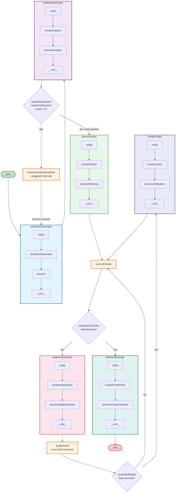

more in file .claude/skills/orchestration-tools-context/SKILL.md

```mermaid
flowchart TD
    START(["__start__"]) --> prdGenGraph

    subgraph prdGenGraph ["prdGeneratorGraph"]
        direction TB
        genSetup["setup"] --> genInvoke["invokePrdGenerator"] --> genProcess["process"] --> genEnd["__end__"]
    end

    prdGenGraph --> prdAnalyzeGraph

    subgraph prdAnalyzeGraph ["prdAnalyzerGraph"]
        direction TB
        analyzeSetup["setup"] --> analyzeInvoke["invokeAnalyzer"] --> analyzeProcess["processAnalysis"] --> analyzeEnd["__end__"]
    end

    prdAnalyzeGraph --> router{"routeAfterAnalyzer<br/>needsClarification?<br/>round < 5?"}

    router -->|Yes| answerClarif["answerClarificationsNode<br/>Langgraph.interrupt"]
    router -->|No / limit reached| plannerSubgraph

    answerClarif -->|Human resumes| prdGenGraph

    subgraph plannerSubgraph ["plannerGraph"]
        direction TB
        planSetup["setup"] --> planInvoke["invokePlanner"] --> planProcess["processPlanning"] --> planEnd["__end__"]
    end

    plannerSubgraph --> controller["controllerNode"]

    controller --> routeCtrl{"routeAfterController<br/>allTasksDone?"}

    routeCtrl -->|No| implGraph

    subgraph implGraph ["implementerGraph"]
        direction TB
        implSetup["setup"] --> implInvoke["invokeImplementer"] --> implProcess["processImplementation"] --> implEnd["__end__"]
    end

    implGraph --> builder["builderNode<br/>runs build command"]

    builder --> routeBuild{"routeAfterBuilder<br/>build success?"}

    routeBuild -->|Yes| verGraph

    subgraph verGraph ["verifierGraph"]
        direction TB
        verSetup["setup"] --> verInvoke["invokeVerifier"] --> verProcess["processVerification"] --> verEnd["__end__"]
    end

    verGraph --> controller

    routeBuild -->|No| controller

    routeCtrl -->|Yes| finalGraph

    subgraph finalGraph ["finalVerifierGraph"]
        direction TB
        fvSetup["setup"] --> fvInvoke["invokeFinalVerifier"] --> fvProcess["processFinalVerification"] --> fvEnd["__end__"]
    end

    finalGraph --> END(["__end__"])

    style prdGenGraph fill:#e1f5ff,stroke:#01579b,stroke-width:2px
    style prdAnalyzeGraph fill:#f3e5f5,stroke:#4a148c,stroke-width:2px
    style answerClarif fill:#fff3e0,stroke:#e65100,stroke-width:2px
    style plannerSubgraph fill:#e8f5e9,stroke:#2e7d32,stroke-width:2px
    style controller fill:#fff3e0,stroke:#e65100,stroke-width:2px
    style implGraph fill:#fce4ec,stroke:#c62828,stroke-width:2px
    style builder fill:#fff3e0,stroke:#e65100,stroke-width:2px
    style verGraph fill:#e8eaf6,stroke:#283593,stroke-width:2px
    style finalGraph fill:#e0f2f1,stroke:#004d40,stroke-width:2px
    style START fill:#c8e6c9,stroke:#1b5e20,stroke-width:2px
    style END fill:#ffcdd2,stroke:#b71c1c,stroke-width:2px
```
