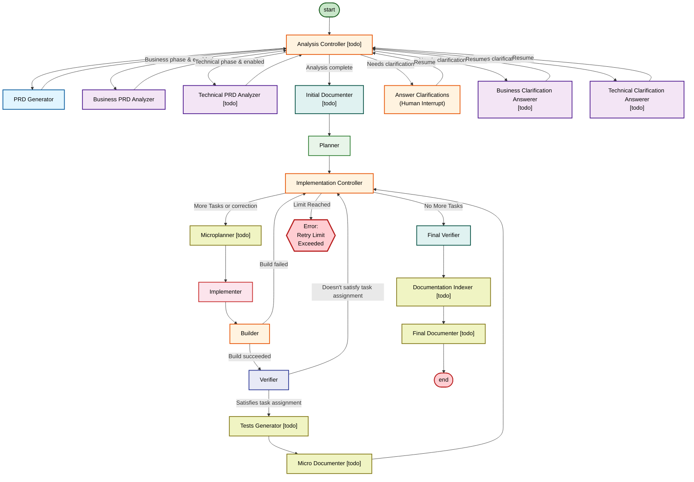

# Infinite Interns

**Currently in development**

A LangGraph-based autonomous development pipeline that orchestrates specialized AI agents to implement features end-to-end, complete with a React UI for management. The pipeline is generic and highly customizable with togglable modules.

At its core, the pipeline assumes that initial feature definitions are incomplete. Before any code is written, it runs an interactive clarification phase with the developer to fill in gaps and ambiguities, ensuring a solid specification before implementation begins. From there, Infinite Interns handles implementation, documentation, and test updates automatically — resources that are essential for high-quality AI-driven results.

Infinite Interns compresses roughly 5 hours of manual work into 30 minutes. The developer's role shifts from writing step-by-step prompts to defining the desired features and refining the output, delivering consistently better results than fully AI-generated code from conventional agentic tools.

## Pipeline Architecture



## What It Does

The pipeline automates feature implementation in two main phases:

### Analysis Phase

Validates and clarifies requirements (business & technical).

The analysis is divided into two blocks. Business requirements and technical requirements. In each block, an agent takes the assignment, current prd and the current clarifications array. Then it analyzes the assignment and generates clarifying questions or marks the prd as clear enough (no more clarifications needed). After the questions are generated, either the user (human) or an answerer agent answers them. This repeats in a loop for maximum of configured amount of loops. Analysis controller keeps the current state in it's internal variables and tracks what node/agent to execute.

There are three settings for both block:

1. disabled - the workflow will skip the business/technical analysis (the planner might get only the bare assignment at it's input)
2. interactive - human answers the clarifications
3. auto - an answerer agent answers the clarifications

### Documentation Phase

After implementation completes, the Documentation Indexer creates or updates a master documentation index that serves as the entry point to all docs. This index is a structured map of all documentation files and code blocks, organized hierarchically. All LLM agents receive this index with their prompts, enabling them to:

- Intelligently fetch only relevant documentation sections
- Avoid reading entire huge documentation files
- Track which documentation areas need updates
- Maintain documentation consistency across the codebase

### Implementation Phase

Executes tasks with build & verification loops.

**Agents** (LLM-powered):

- **PRD Generator**: Takes the human inputs - task assignment and clarifications and converts it into a detailed Product Requirements Document.
- **Business PRD Analyzer**: Analyzes the PRD against business requirements to identify gaps and generates clarifying questions for the user.
- [todo] **Technical PRD Analyzer**: Analyzes the PRD against technical requirements and architecture to identify gaps and generates clarifying questions for the user.
- [todo] **Business Clarification Answerer**: Automatically answers business requirement clarification questions generated by the Business PRD Analyzer (user-configurable).
- [todo] **Technical Clarification Answerer**: Automatically answers technical clarification questions generated by the Technical PRD Analyzer (user-configurable).
- **Planner**: Breaks the finalized PRD into sequential, implementable tasks and determines the build command.
- **Implementer**: Implements code changes for a single task from planner.
- **Verifier**: Validates that the implementation satisfies the current task requirements.
- **Final Verifier**: Performs holistic verification of the entire implementation after all tasks complete and provides final summary as the output of the pipeline.
- [todo] **Microplanner**: Creates a micro-plan for the implementer. It analyzes the current codebase patterns and determines which ones to use. This is an attempt to limit the situations when an implementing agent overlooks certain solutions the codebase already has and tries to re-invent them.
- [todo] **Initial Documenter**: After the prd is created, it creates new documentation files or modifies existing ones with a tag "currently implementing" (in the new files and also in the modified blocks in existing documentation).
- [todo] **Micro Documenter**: After each task is finished and verified, the micro documenter determines whether documentation needs updating with new information that had to be unexpectedly researched or added as part of the task and if it does, it modifies it in the same way as the Initial Documenter.
- [todo] **Final Documenter**: Removes the "currently implementing" tags and polishes the overall documentation added.
- [todo] **Tests Generator**: After each task, it determines whether the new code deserves a separate unit test or enhancement to existing unit tests and if so, it implements it. This can also modify the build command to run tests if not part of it yet.
- [todo] **Documentation Indexer**: Maintains a master documentation index file that serves as the entry point to all documentation. The index provides a structured map to other documentation files and code blocks, allowing all LLM agents to efficiently query only relevant documentation without needing to read entire documentation files (which can become huge). This index is always fed to agents along with their prompts to enable context-aware documentation lookups.

**Nodes** (Deterministic logic):

- [todo] **Analysis Controller**: Routes between business and technical analysis phases, handles clarification round limits, and decides when to move to documentation.
- **Answer Clarifications**: Presents analyzer questions to the human and collects answers via LangGraph interrupt, then returns to Analysis Controller.
- **Implementation Controller**: Orchestrates the implementation loop by managing task iteration and a unified failed-attempt counter per task (both build failures and verification failures increment the same counter; resets on task success). Routes to Tests Generator and Micro Documenter post-verification, or throws error on limit exceeded.
- **Builder**: Runs the build command and checks the exit code; routes to verifier on success or back to controller on failure. Test runs can be part of the build command.

## Configuration

All settings are organized into presets, managed via the preset management UI, and stored locally in SQLite. Presets can be switched between runs.

### Agent Toggles (Implemented ✅)

Enable/disable specific agents in the pipeline:

- **Business Clarifications**: Toggle Business PRD Analyzer and Business Clarification Answerer
- **Technical Clarifications**: Toggle Technical PRD Analyzer and Technical Clarification Answerer
- **Microplanner**: Toggle Microplanner agent
- **Builder**: Toggle Builder node
- **Micro Verifier**: Toggle Verifier node
- **Final Verifier**: Toggle Final Verifier agent

### Analysis Phase Settings (Partial ✅)

Control how the analysis phase processes requirements:

- **Business Clarification Rounds**: Maximum loop count for business analysis phase before proceeding (configurable per preset)
- **Technical Clarification Rounds**: Maximum loop count for technical analysis phase before proceeding (configurable per preset)

**[TODO]** Clarification modes (disabled/interactive/auto) - Framework exists but full implementation pending

### Agent Settings (Implemented ✅)

Each LLM agent can be configured individually:

- **Model**: LLM model selection per agent (29+ Gemini models supported)
- **Temperature**: Temperature setting (0-2) per agent
- **Thinking**: Enable/disable reasoning output per agent
- **Retry Attempts**: Per-agent in-session and cross-session retry limits
- **Backends**: Filesystem permission level per agent:
  - `ReadOnlyBackend`: No filesystem access
  - `ReadOnlyShellBackend`: Read-only + execute shell commands
  - `LocalShellBackend`: Full filesystem + shell access
- **Custom Rules**: Custom instructions per agent (plain text)
- **[TODO] Provider**: LLM provider selection per agent (currently Google-only globally)

### Build & Implementation Settings (Implemented ✅)

- **Build Command**: Custom build command for the project
- **Build Command Auto-Detect**: Automatically detect build command from `package.json`
- **Max Implementation Attempts**: Unified failure limit per task (build + verification failures combined)

### Rate Limiting Settings (Implemented ✅)

Global rate limit configuration per preset:

- **Max RPM** (Requests Per Minute): Rate limit for API requests
- **Max TPM** (Tokens Per Minute): Token consumption rate limit
- **Max RPD** (Requests Per Day): Daily request limit
- **Max Spending**: Maximum daily spending in USD

### Documentation Settings (Not Yet Implemented ⏳)

**[TODO]** Global documentation control:

- **Documentation Enabled**: Enable/disable all documentation agents (all-or-nothing)
  - When disabled: Initial Documenter, Micro Documenter, Final Documenter, Documentation Indexer skipped
  - When enabled: Documentation index path and docs folder path required

- **Documentation Index Path**: Path to master documentation index file (relative or absolute)
  - Entry point to all documentation

- **Docs Folder Path**: Path to documentation directory (relative or absolute)
  - Contains all documentation files referenced in the index

### Preset Management (Implemented ✅)

- **Preset Creation/Deletion**: Create multiple named presets with different configurations
- **Preset Selection**: Select active preset before pipeline execution
- **Preset Persistence**: Presets stored in SQLite database
- **Thread Association**: Each pipeline execution thread can use a specific preset

### Additional Settings (Not Yet Implemented ⏳)

- Custom tools per agent
- LLM provider selection (currently Google-only)
- API keys management
- Timeout configuration

## Future Enhancements

### Customizations for Agents (partially implemented)

**Remaining:**

- LLM provider selection (currently Google-only)
- Custom tools per agent
- Rate limits enforcement
- Agent toggles (disabling specific pipeline stages)

### System configuration and modes

**Remaining:**

- API keys management
- Timeouts

### Parallel execution

**Launch the implementation loops in parallel to complete the PRD implementation faster**

Each loop is going to get it's own git worktree and implements the changes in a branch. After all loops finish, a merger agent is going to merge all changes. This will also require launching implementations in "waves" as certain tasks might be dependant on other tasks to be completed first.

## Quick Start

### Prerequisites

- **Node.js**: >= 20
- **Google API Key**: Set `GOOGLE_API_KEY` in `packages/backend/.env`

### Setup

```bash
# Install dependencies (monorepo workspaces)
npm install

# Create backend environment file
# packages/backend/.env
GOOGLE_API_KEY=your-google-api-key
LANGSMITH_API_KEY=your-langsmith-key  # Optional
LANGGRAPH_SCHEMA_RESOLVE_TIMEOUT_MS=120000
```

### Running

```bash
# Run both backend and frontend
npm run dev:both

# OR run separately:
npm run dev              # Backend (LangGraph Studio at localhost:8123)
npm run dev:frontend    # Frontend (React UI at localhost:5173)
```

## Project Structure

```
infinite-interns/
├── packages/
│   ├── backend/              # LangGraph pipeline
│   │   └── src/agents/       # AI agents
│   └── frontend/             # React UI
│       └── src/
└── docs/
```

## Key Components

- **Agents** (LLM-powered): Generator, Analyzer, Planner, Implementer, Verifier, Final Verifier
- **Nodes** (Deterministic): Controller, Builder, Answer Clarifications
- **Backends**: Read-only, Read+Execute, and Full-access permission modes
- **Frontend**: React dashboard with phase tracking and interrupt handling

## Technologies

- LangChain + LangGraph
- Google Gemini (gemini-3-flash-preview)
- TypeScript, React 19, Vite, TailwindCSS
- Vitest for testing

## Available Commands

```bash
# Root
npm run dev           # Backend only
npm run dev:frontend  # Frontend only
npm run dev:both      # Both
npm run fix           # Lint + format + type check
npm run test          # Run tests

# Backend only
cd packages/backend
npm run dev           # LangGraph Studio
npm run fix           # Quality checks
npm run test          # Tests

# Frontend only
cd packages/frontend
npm run dev           # Dev server
npm run build         # Production build
```

## Documentation

Detailed technical documentation available in `.claude/skills/infinite-interns-context/`

- Architecture patterns and state design
- Guide for creating new agents
- Testing best practices
- Code style requirements

## License

MIT
