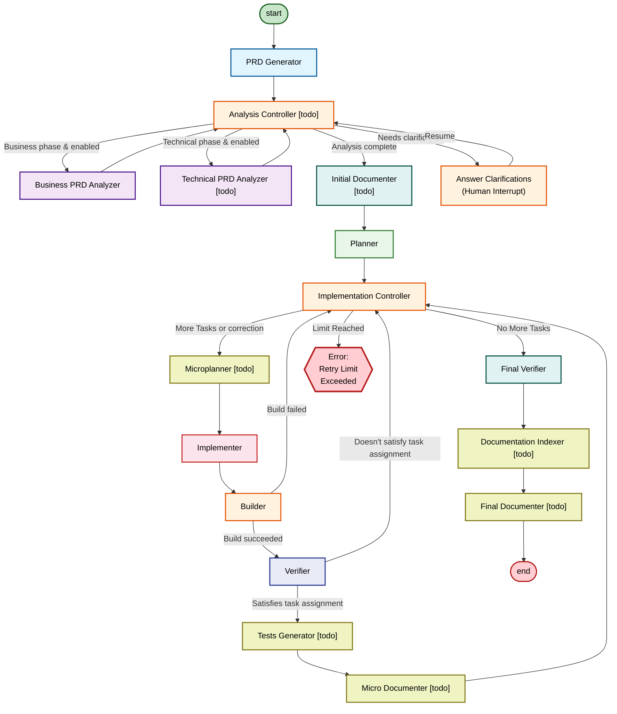

# Infinite Interns

**Currently in development**

A LangGraph-based autonomous software development pipeline that orchestrates specialized AI agents to help with every-day software development.

## Pipeline Architecture



## What It Does

The pipeline automates feature implementation in two main phases:

1. **Analysis Phase**: Validates and clarifies requirements (business & technical)
2. **Implementation Phase**: Executes tasks with build & verification loops

**Agents** (LLM-powered):

- **PRD Generator**: Takes the human inputs - task assignment and clarifications and converts it into a detailed Product Requirements Document.
- **Business PRD Analyzer**: Analyzes the PRD against business requirements to identify gaps and generates clarifying questions for the user.
- [todo] **Technical PRD Analyzer**: Analyzes the PRD against technical requirements and architecture to identify gaps and generates clarifying questions for the user.
- **Planner**: Breaks the finalized PRD into sequential, implementable tasks and determines the build command.
- **Implementer**: Implements code changes for a single task from planner.
- **Verifier**: Validates that the implementation satisfies the current task requirements.
- **Final Verifier**: Performs holistic verification of the entire implementation after all tasks complete and provides final summary as the output of the pipeline.
- [todo] **Microplanner**: Creates a micro-plan for the implementer. It analyzes the current codebase patterns and determines which ones to use. This is an attempt to limit the situations when an implementing agent overlooks certain solutions the codebase already has and tries to re-invent them.
- [todo] **Initial Documenter**: After the prd is created, it creates new documentation files with a tag "currently implementing".
- [todo] **Micro Documenter**: After each task is finished and verified, the micro documenter determines whether documentation needs updating with new information that had to be unexpectedly researched or added as part of the task.
- [todo] **Final Documenter**: Removes the "currently implementing" tags and polishes the overall documentation added.
- [todo] **Tests Generator**: After each task, it determines whether the new code deserves a separate unit test or enhancement to existing unit tests and if so, it implements it.

**Nodes** (Deterministic logic):

- [todo] **Analysis Controller**: Routes between business and technical analysis phases, handles clarification round limits, and decides when to move to documentation.
- **Answer Clarifications**: Presents analyzer questions to the human and collects answers via LangGraph interrupt, then returns to Analysis Controller.
- **Implementation Controller**: Orchestrates the implementation loop by managing task iteration and retry limits for builder (N per task) and verifier (N per task). Routes to Tests Generator and Micro Documenter post-verification, or throws error on limit exceeded.
- **Builder**: Runs the build command and checks the exit code; routes to verifier on success or back to controller on failure. Test runs can be part of the build command.
- [todo] **Documentation indexer**: Runs indexation of the documentation.

## Future Enhancements

### Customizations for Agents

**The user is going to be able to configure each agent individually**
- LLM provider
- Model
- Limits
- Temperature/Heat/Effort
- Custom tools
- Backends
- Thinking
- Custom rules
- Number of retry attempts


The system is going to store the Agent configurations locally so the user can have presets and switch between them.

### System configuration and modes

**The user is going to be able to configure various system, then create and manage mode presets from them.**
- Set certain nodes or sections disabled/enabled
- Set specific agent for specific node
- API keys
- Timeouts
- Number of retry attempts for logically connected nodes (loops)

### Parallel execution

**Launch the implementation loops in parallel to complete the PRD implementation faster**

Each loop is going to get it's own git worktree and implements the changes in a branch. After all loops finish, a merger agent is going to merge all changes. This will also require launching implementations in "waves" as certain tasks might be dependant on other tasks to be completed first.

## Quick Start

### Prerequisites

- **Node.js**: >= 20
- **Google API Key**: Set `GOOGLE_API_KEY` in `packages/backend/.env`

### Setup

```bash
# Install dependencies (monorepo workspaces)
npm install

# Create backend environment file
# packages/backend/.env
GOOGLE_API_KEY=your-google-api-key
LANGSMITH_API_KEY=your-langsmith-key  # Optional
LANGGRAPH_SCHEMA_RESOLVE_TIMEOUT_MS=120000
```

### Running

```bash
# Run both backend and frontend
npm run dev:both

# OR run separately:
npm run dev              # Backend (LangGraph Studio at localhost:8123)
npm run dev:frontend    # Frontend (React UI at localhost:5173)
```

## Project Structure

```
infinite-interns/
├── packages/
│   ├── backend/              # LangGraph pipeline
│   │   └── src/agents/       # AI agents
│   └── frontend/             # React UI
│       └── src/
└── docs/
```

## Key Components

- **Agents** (LLM-powered): Generator, Analyzer, Planner, Implementer, Verifier, Final Verifier
- **Nodes** (Deterministic): Controller, Builder, Answer Clarifications
- **Backends**: Read-only, Read+Execute, and Full-access permission modes
- **Frontend**: React dashboard with phase tracking and interrupt handling

## Technologies

- LangChain + LangGraph
- Google Gemini (gemini-3-flash-preview)
- TypeScript, React 19, Vite, TailwindCSS
- Vitest for testing

## Available Commands

```bash
# Root
npm run dev           # Backend only
npm run dev:frontend  # Frontend only
npm run dev:both      # Both
npm run fix           # Lint + format + type check
npm run test          # Run tests

# Backend only
cd packages/backend
npm run dev           # LangGraph Studio
npm run fix           # Quality checks
npm run test          # Tests

# Frontend only
cd packages/frontend
npm run dev           # Dev server
npm run build         # Production build
```

## Documentation

Detailed technical documentation available in `.claude/skills/infinite-interns-context/`

- Architecture patterns and state design
- Guide for creating new agents
- Testing best practices
- Code style requirements

## License

MIT
